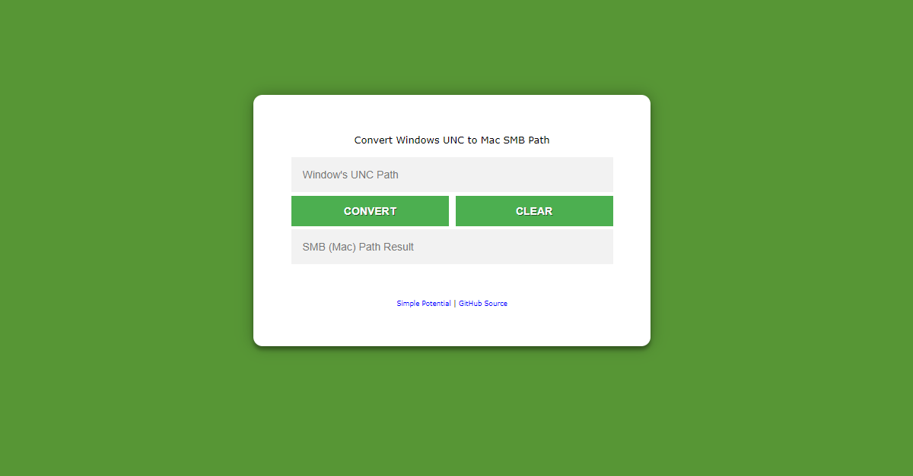

# UncToSmb
Small tool to help convert a Windows UNC path to a MAC SMB Path

A recent request to assist a colleague with converting a Windows UNC path to a Mac SMB path highlighted a potential need for a user-friendly solution. Recognizing that this conversion can be challenging for some users, I developed a small, open-source tool to automate the process. This tool streamlines the conversion task for both the initial user and anyone who may encounter it in the future. The tool operates entirely on the client-side, ensuring complete privacy as no data is stored or tracked. Feel free to explore and use the tool at your convenience.

https://simplepotential.github.io/UncToSmb/

